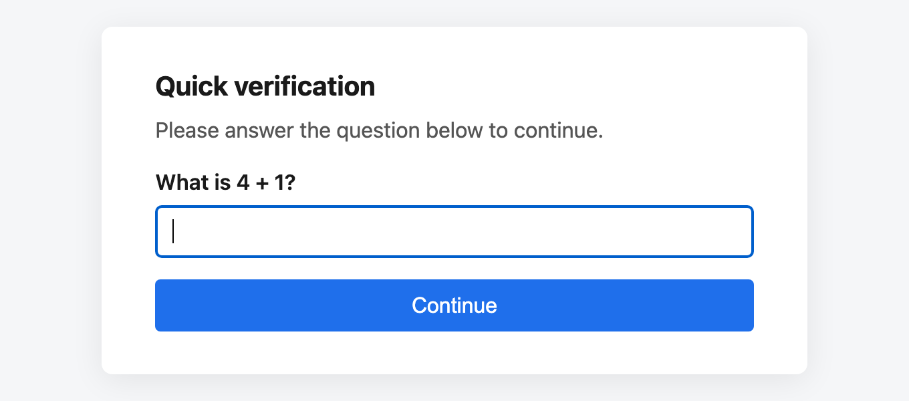
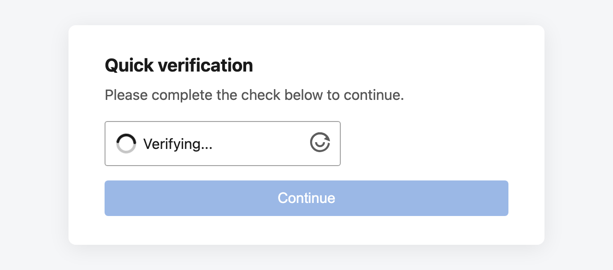
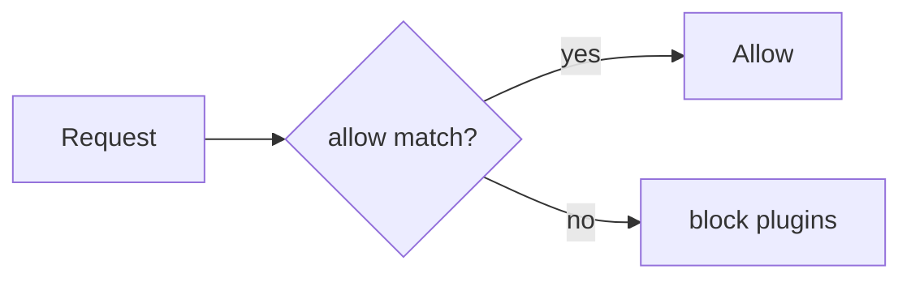

# Writing Documentation

Everything on this site is a Markdown file in the [`docs/`](https://github.com/kanopi/firewall/tree/2.x/docs)
directory of the main repository. There is no CMS and no separate docs repo — a
documentation change is an ordinary pull request against `2.x`.

## The two-minute path

Every page has a :material-pencil: **edit** icon in its top-right corner. Click
it and GitHub opens that exact Markdown file in its web editor. Make your
change, click **Commit changes**, and GitHub walks you through forking the repo
and opening a pull request. You never leave the browser and you never install
anything.

Use this for typos, clarifications, a missing option, a wrong default. It is
the intended path for most documentation changes.

## Previewing locally

Worth the setup if you are adding pages, moving things around, or touching
anything with screenshots.

```bash
# One-time setup
python3 -m venv .venv-docs
source .venv-docs/bin/activate
pip install -r docs/requirements.txt

# Live-reloading preview on http://127.0.0.1:8000
mkdocs serve
```

`mkdocs serve` rebuilds and refreshes the browser every time you save. To
reproduce exactly what CI does — including turning every warning into an error:

```bash
mkdocs build --strict
```

!!! tip "Run `--strict` before you push"

    CI runs `mkdocs build --strict`, which fails the build on a broken internal
    link, a link to a page that is not in the nav, or a missing snippet file.
    Catching that locally is faster than waiting for CircleCI.

## Where things live

```text
docs/
├── index.md                    Home page
├── getting-started/            Install → first blocked request
├── configuration/              Every YAML key, one page per section
├── plugins/                    One page per plugin
├── presets/                    The shipped rule sets
├── guides/                     Task-oriented walkthroughs
├── reference/                  Lookup tables
├── contributing/               Process (this section)
├── requirements.txt            Pinned docs toolchain
└── assets/
    ├── images/                 Screenshots and diagrams
    └── stylesheets/extra.css   Small style overrides
```

The site structure is not inferred from the directory tree — it comes from the
`nav:` block in [`mkdocs.yml`](https://github.com/kanopi/firewall/blob/2.x/mkdocs.yml)
at the repo root. **A new page must be added to `nav:` or the build fails.**

```yaml
nav:
  - Plugins:
      - plugins/index.md
      - IP Address: plugins/ip-address.md
      - My New Plugin: plugins/my-new-plugin.md   # <- add your page here
```

An entry written as a bare path (`plugins/index.md`) takes its title from the
page's `#` heading. An entry written as `Label: path` uses the label in the
sidebar. Prefer the bare path unless the heading is too long for a sidebar.

## Page conventions

- **One `#` heading per page**, and it comes first. Everything else is `##` or
  deeper. Skipping a level (`##` straight to `####`) breaks the table of
  contents.
- **Sentence case for headings**, except where a proper noun or a config key
  demands otherwise.
- **Config keys, class names, file paths, and CLI flags go in backticks.**
- **Link to other pages with relative Markdown paths**, including the `.md`
  extension: `[Rate Limit](../plugins/rate-limit.md)`. MkDocs rewrites those to
  the right URLs and `--strict` verifies every one of them. Never hand-write a
  site-absolute URL.
- **Prefer a table over a bulleted list** when every item shares the same
  fields — options, exceptions, modes, and return values all read better as
  tables.
- **Say what the default is.** Every documented option should state its default
  value and what happens when it is omitted.

## Code snippets

Always tag the language. It drives both syntax highlighting and the copy button.

````markdown
```yaml
plugins:
  - plugin: "Kanopi\\Firewall\\Plugins\\IpAddress"
    response: block
```
````

### Tabs for per-platform variants

Use tabbed blocks when the same task differs by framework. Tabs with matching
labels stay in sync across the whole site — a reader who picks "WordPress" once
sees WordPress everywhere.

````markdown
=== "Drupal"

    ```php
    // settings.php
    Firewall::create([__DIR__ . '/firewall.yml'])->evaluate();
    ```

=== "WordPress"

    ```php
    // wp-config.php
    Firewall::create([__DIR__ . '/firewall.yml'])->evaluate();
    ```
````

### Annotations

Numbered callouts attach prose to a specific line without cluttering the code.
Add `!` after the language to keep the annotation markers out of the copy
buffer.

````markdown
```yaml
global:
  mode: block        # (1)!
  require_config: true
```

1.  `log` evaluates plugins but never terminates the request. Use it to audit
    a rule set before enforcing it.
````

### Embedding real files

The best way to keep an example honest is to not copy it. `--8<--` pulls the
actual shipped file into the page at build time, so it cannot drift:

````markdown
```yaml title="presets/wordpress.yml"
--8<-- "presets/wordpress.yml"
```
````

Paths are relative to the repository root. If the file moves or is deleted, the
build fails instead of silently serving a stale example.

## Admonitions

Use them deliberately — a page where everything is highlighted highlights
nothing.

```markdown
!!! note
    Neutral, useful aside.

!!! tip
    A better way to do the thing.

!!! warning
    Doing this wrong degrades security or breaks something.

!!! danger
    Doing this wrong exposes the application to attack.

??? example "Collapsed by default"
    Long configuration dumps belong in a collapsed block.
```

Reserve **warning** and **danger** for genuine security consequences. This
library is a firewall; readers need those to still mean something when they
matter.

## Screenshots

Screenshots live in `docs/assets/images/<section>/`, named for what they show:

```text
docs/assets/images/
├── challenges/
│   ├── math-interstitial.png
│   └── altcha-interstitial.png
└── demo/
    └── blocked-response.png
```

Reference them with a relative path and **always** write alt text:

```markdown

```

Images are click-to-zoom automatically. To opt a specific image out — small
inline icons, for instance — add `{ .off-glb }` after it.

### Capture guidelines

| Rule | Why |
|---|---|
| Capture at **1280–1440px** wide, 2× DPI | Sharp on retina, still legible when the theme scales it down. |
| **PNG** for UI, **JPG** for photos | PNG keeps text edges crisp; JPG keeps photo file sizes down. |
| Keep files **under ~300 KB** | They are committed to the repo and served from GitHub Pages. |
| Crop to the relevant region | A full-desktop screenshot to show one dialog wastes the reader's attention. |
| Use the **light theme** unless the page is about dark mode | Screenshots do not follow the reader's theme toggle, so a dark screenshot on a light page looks broken. |
| **Never** capture real IPs, hostnames, tokens, or customer data | Use `192.0.2.0/24`, `example.com`, and obviously-fake secrets. |

Add a caption by giving the image a `title`, which the lightbox also picks up:

```markdown

```

### Reproducing the app for a screenshot

The demo application renders the real interstitials and block pages:

```bash
composer demo          # http://localhost:8000
composer demo:reset    # clear stored blocks between captures
```

See [Demo Application](../guides/demo.md) for the available routes.

## Diagrams

Prefer a Mermaid diagram over a screenshot of a diagram — it stays editable, it
scales, and it adapts to the reader's theme.

````markdown

````

## Checklist before opening the PR

- [ ] `mkdocs build --strict` passes locally, or CI is green on the PR
- [ ] New pages are listed in `nav:` in `mkdocs.yml`
- [ ] Exactly one `#` heading per page, no skipped heading levels
- [ ] Cross-references use relative `.md` paths
- [ ] Code fences declare a language
- [ ] Every option documented states its default
- [ ] Screenshots have alt text, are cropped, and contain no real data
- [ ] No secrets, customer data, or internal hostnames anywhere

## What CI does with your PR

CircleCI builds the site on every branch and every pull request and attaches
the rendered HTML as a build artifact, so a reviewer can read your change as a
real page before approving it. Open the **Artifacts** tab on the `docs-build`
job and click `docs/index.html`.

Merging to `2.x` publishes to <https://kanopi.github.io/firewall/>.
