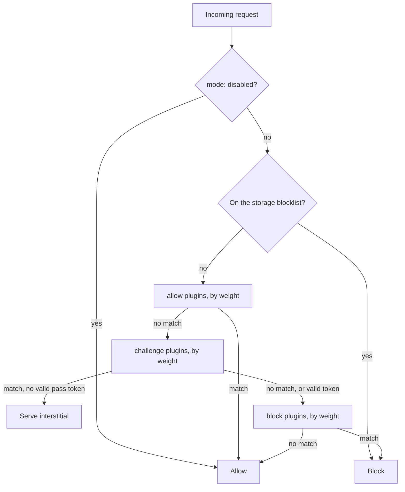

---
hide:
  - navigation
---

# Lite Firewall

**Lite Firewall** is a powerful, extensible request-evaluation library for PHP-based systems. It analyzes HTTP requests and applies configurable rules to allow, challenge, or block access based on IP addresses, geolocation, user agents, URLs, ASN (Autonomous System Numbers), rate limits, vulnerability scoring, and the OWASP Core Rule Set.

It is framework agnostic — it works with Drupal, WordPress, Symfony, Laravel, or any standalone PHP application.

```bash
composer require kanopi/firewall
```

```php
require_once __DIR__ . '/vendor/autoload.php';

\Kanopi\Firewall\Firewall::create([__DIR__ . '/config/firewall.yml'])->evaluate();
```

<div class="grid cards" markdown>

-   :material-rocket-launch-outline:{ .lg .middle } **Getting Started**

    ---

    Install the library, write a minimal config, and block your first request
    against a local PHP server.

    [:octicons-arrow-right-24: Quick start](getting-started/quick-start.md)

-   :material-cog-outline:{ .lg .middle } **Configuration**

    ---

    Every key the YAML accepts: modes, storage, includes, environment
    variables, conditional logic, and logging.

    [:octicons-arrow-right-24: Configuration reference](configuration/index.md)

-   :material-puzzle-outline:{ .lg .middle } **Plugins**

    ---

    Ten built-in evaluators — IP, GeoLocation, URL, User Agent, ASN, Rate
    Limit, Vulnerability Score, OWASP CRS, and AbuseIPDB.

    [:octicons-arrow-right-24: Browse plugins](plugins/index.md)

-   :material-package-variant-closed:{ .lg .middle } **Presets**

    ---

    Ship-ready rule sets for malicious requests, rate limiting, WordPress, and
    Pantheon. Include one line and you are protected.

    [:octicons-arrow-right-24: Available presets](presets/available.md)

</div>

## Features

- **Flexible Plugin System**: Modular architecture allows for easy extension and customization
- **Multiple Storage Backends**: In-memory, file-based, and database storage for blocked clients, plus in-memory, file, database, PSR-6 cache, and Redis backends for rate-limit counters — or bring your own
- **Comprehensive Request Analysis**: Evaluate requests based on IP, location, ASN, user agent, URL patterns, and more
- **OWASP Core Rule Set**: Real CRS rules (SQLi, XSS, LFI/RFI, RCE, scanners) with tunable paranoia levels
- **IP Reputation**: Turn away addresses reported to AbuseIPDB, cached to stay inside the free tier and failing open when the service is unreachable
- **Vulnerability Scoring**: Advanced risk assessment based on multiple factors with configurable thresholds
- **Rate Limiting**: Built-in rate limiting with configurable storage backends
- **Challenge Responses**: Serve a proof-of-effort interstitial instead of a hard block, with HMAC-signed, IP-bound pass tokens
- **GeoIP Integration**: Full support for MaxMind GeoIP2 databases (both local and web service)
- **Advanced Conditional Logic**: Support for simple, complex, and grouped conditional rules
- **Escalating Bans**: Repeat offenders can be banned for progressively longer, up to permanently
- **Remote Configuration Support**: Load configuration files from remote URLs with local caching
- **PSR-3 Compatible Logging**: Integration with Monolog for flexible logging, with sensitive headers redacted by default
- **Framework Agnostic**: Works with any PHP application or framework — block, log-only, or throw exceptions for your framework to handle

## How a request flows



Allow plugins short-circuit everything. A valid challenge pass token skips the
challenge bucket but never suppresses a block. See
[Plugin Architecture](plugins/index.md) for the full ordering rules and
[Challenge Responses](plugins/challenges.md) for the interstitial flow.

## Where to go next

| I want to… | Read |
|---|---|
| Get something running locally in five minutes | [Test Drive](getting-started/test-drive.md) |
| Drop this into Drupal, WordPress, Symfony, or Laravel | [Platform Integration](getting-started/platform-integration.md) |
| Understand every configuration key | [Configuration Overview](configuration/index.md) |
| Stop bots without hard-blocking humans | [Challenge Responses](plugins/challenges.md) |
| Use a ready-made rule set | [Available Presets](presets/available.md) |
| Catch exceptions instead of letting the library `exit()` | [Error Handling](guides/error-handling.md) |
| Write my own plugin or storage backend | [Custom Plugins](guides/custom-plugins.md) · [Custom Storage](guides/custom-storage.md) |
| Migrate an old `bypass:` / `block:` config | [Legacy Config Format](reference/legacy-format.md) |
| Contribute code or docs | [Contributing](contributing/index.md) |

## Requirements

- PHP 8.1 or higher
- Composer
- Symfony components 6.4, 7.3, or 8.1 (Composer picks whichever line your PHP version and application allow)
- Optional: MaxMind GeoIP2 databases for geolocation features
- Optional: Redis for distributed rate limiting

## Support

- **Issues**: [github.com/kanopi/firewall/issues](https://github.com/kanopi/firewall/issues)
- **Source**: [github.com/kanopi/firewall](https://github.com/kanopi/firewall)
- **Package**: [packagist.org/packages/kanopi/firewall](https://packagist.org/packages/kanopi/firewall)

## License

Released under the [MIT License](https://github.com/kanopi/firewall/blob/2.x/LICENSE).
Developed and maintained by [Kanopi Studios](https://kanopi.com).
