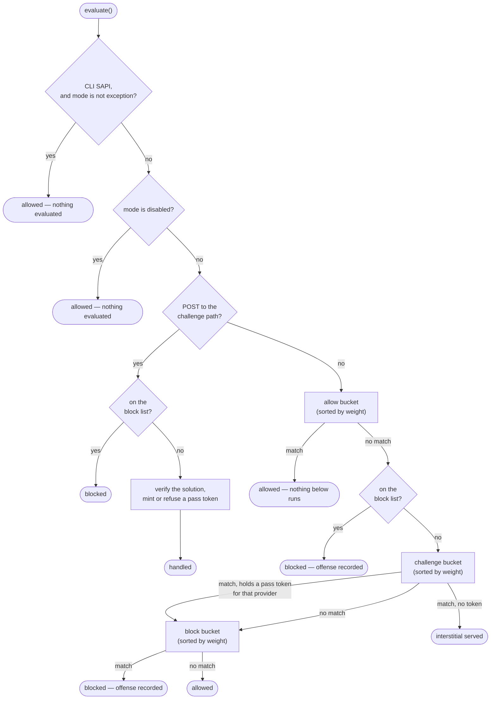

# Evaluation Order

What runs, in what order, when `Firewall::evaluate()` is called. This is the single most
misunderstood thing in the library, and most "why didn't my allow rule win?" questions are
answered by one line of it.



## The order, in words

| | Step | Notes |
|---|---|---|
| 1 | **CLI short-circuit** | Returns immediately under `PHP_SAPI === 'cli'` for every mode except `exception`. Drush, WP-CLI, Artisan and cron have no visitor to protect. |
| 2 | **`mode: disabled`** | Nothing is evaluated. A [panic file](../configuration/global.md#panic-switch) can put you here without a deploy. |
| 3 | **Challenge submission** | A POST to `challenge.path` is intercepted *before any bucket*, so an unrelated rule can never trap a visitor in a challenge loop. The block list is still enforced first — a client that already earned a ban does not get to solve its way out. |
| 4 | **Allow bucket** | First bucket. A match ends evaluation. |
| 5 | **Durable block list** | Storage-backed repeat-offender state, from earlier requests. |
| 6 | **Challenge bucket** | A valid pass token *for that rule's provider* skips it. |
| 7 | **Block bucket** | A match records an offense and refuses the request. |
| 8 | **Allowed** | Nothing objected. |

## The three things people get wrong

### Weights sort within a bucket, not across them

`weight` orders rules **inside** one bucket. It has no effect between buckets, because the
bucket order is fixed. An allow rule with the worst weight in the file still beats a block
rule with the best:

```
ALLOWED  GET /
  allowed by        allow-last

Configured but not reached:
  block     block-first    Kanopi\Firewall\Plugins\IpAddress    weight -9999
```

So if an allow rule appears not to be winning, it almost certainly **did not match** — check
the CIDR, and check that the client IP is what you think it is. `firewall-check --explain`
prints which rules were evaluated and which were never reached.

### `response: allow` also beats the durable block list

The allow bucket runs at step 4 and the block list at step 5, so a client that is on the
block list *and* matches an allow rule is **let through**. That is a bypass, and it is what
an allow rule is for — but it means an allow rule is not a safe place for a broad range:

```yaml
# This lets a banned client back in for as long as it is in the range.
- plugin: "Kanopi\\Firewall\\Plugins\\IpAddress"
  response: allow
  config: ['203.0.113.0/24']
```

### A pass token skips the challenge bucket, not the block bucket

Solving a challenge attests "I am human". It does not attest "I am allowed everywhere", so
block rules still run afterwards. A token is also only worth the provider it was earned
against — a `math` token does not satisfy a `turnstile` rule.

## What the modes change

| Mode | Buckets evaluated | Storage written | Request continues |
|---|---|---|---|
| `block` | yes | yes | no — response sent, process exits |
| `exception` | yes | yes | no — throws, your framework renders |
| `log` | yes | **no** | **yes** — every decision is reported and none is enforced |
| `disabled` | **no** | no | yes |

`log` is the one worth reading twice: it evaluates everything and enforces nothing,
*including the durable block list*. A listed client is logged and let through, and the ban
is neither enforced nor extended.

An individual rule can observe on its own with `metadata.mode: log` — it matches, logs at
`warning` with `enforced: false`, and is then treated as no match, so everything after it
still runs. That is almost always the better tool than putting the whole site in `log`.

## Seeing it for a real request

```console
$ firewall-check --config=firewall.yml --ip=203.0.113.9 --url=/checkout --explain
```

It prints the buckets in the order above, which rule matched, and which rules were
configured but never reached.
